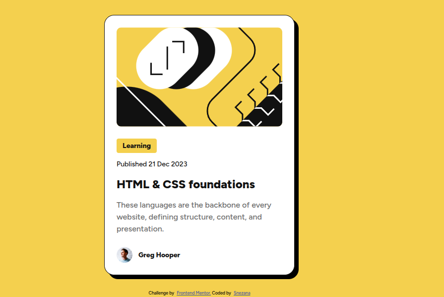

# Frontend Mentor - Blog preview card solution

This is a solution to the [Blog preview card challenge on Frontend Mentor](https://www.frontendmentor.io/challenges/blog-preview-card-ckPaj01IcS). Frontend Mentor challenges help you improve your coding skills by building realistic projects. 

## Table of contents

- [Overview](#overview)
  - [The challenge](#the-challenge)
  - [Screenshot](#screenshot)
  - [Links](#links)
- [My process](#my-process)
  - [Built with](#built-with)
  - [What I learned](#what-i-learned)
- [Author](#author)


## Overview

### The challenge

Users should be able to:

- See hover and focus states for all interactive elements on the page

### Screenshot




### Links

- Solution URL: [Add solution URL here](https://your-solution-url.com)
- Live Site URL: [Add live site URL here](https://your-live-site-url.com)

## My process

### Built with

- Semantic HTML5 markup
- BEM methodology
- CSS custom properties (Variables)
- Flexbox
- Mobile-first workflow

### What I learned
In this project, I focused on writing clean, semantic HTML and implementing a professional CSS structure using BEM. 

Key takeaways:
- **Accessibility:** Used `visually-hidden` class for the main heading to maintain document structure without affecting the visual design.
- **Interactive Elements:** Implemented a "stretched link" technique using the `::after` pseudo-element on the title link. This makes the entire card clickable and improves user experience.
- **Responsive Design:** Used CSS variables combined with Media Queries to handle typography scaling between mobile and desktop versions.

I'm particularly proud of how I handled the focus states:
```css
a:focus-visible {
  outline: 1px solid #007bff;
  outline-offset: 2px;
  border-radius: 2px; 
}
``` 

## Author

- Website - [Add your name here](https://www.your-site.com)
- Frontend Mentor - [@yourusername](https://www.frontendmentor.io/profile/yourusername)


